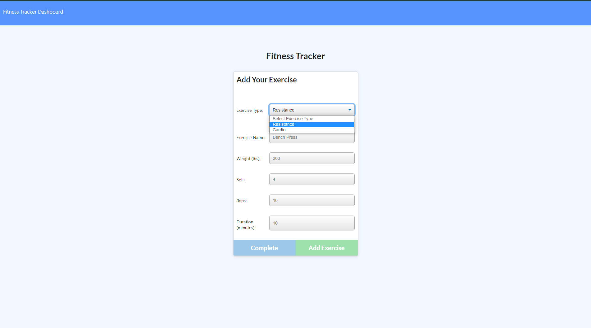

# Fitness_Tracker

## Description

This is an application allows user to track their workouts on a daily basis. User can create new workouts, selecting either Cardio or Resistance exercises, with relevant workout information such as distance, duration, and resistance. Users can also view a statistics dashboard that provide high level information on their last 7 workouts.

- [Description](#description)
- [User Story](#user-story)
- [Acceptance Criteria](#acceptance-criteria)
- [Application Screenshot](#application-screenshot)
- [Technologies](#technologies)
- [Installation](#installation)
- [Usage](#usage)

## User Story

- As a user, I want to be able to view create and track daily workouts. I want to be able to log multiple exercises in a workout on a given day. I should also be able to track the name, type, weight, sets, reps, and duration of exercise. If the exercise is a cardio exercise, I should be able to track my distance traveled.

## Acceptance Criteria

When the user loads the page, they should be given the option to create a new workout or continue with their last workout.

The user should be able to:

- Add exercises to the most recent workout plan.

- Add new exercises to a new workout plan.

- View the combined weight of multiple exercises from the past seven workouts on the `stats` page.

- View the total duration of each workout from the past seven workouts on the `stats` page.

## Application Screenshot

_Main application page screenshot_

_Exercise form for selecting exercise information_

_Statistics Dashboard_

## Technologies

The following packages/technologies were used in the creation of this application.

- MongoDB
- Mongoose
- Express
- Heroku
- MongoDB Atlas

## Installation

There is no installation required for this application as it is hosted on a Heroku server. You can access the [Fitness Tracker](https://calm-dusk-00672.herokuapp.com/?id=5ff9c3c804069e00172e6dab).

To view project files please visit my [GitHub](https://github.com/ntch2000/Workout_Tracker)

## Usage

To utilize this application, go to the application link provided to view the main page with a summary of the last workout that was performed. Users can click either "New Workout" or "Continue Workout" and fill out the form with your exercise information. If you want to add additional exercises to your workout, click "Add Exercise" after filling out the form or click "Complete" to add the final exercise to your workout.

The statistics dashboard can be viewed by clicking the "Dashboard" link on the top left of the navigation bar, and you can return to the main page via the "Fitness Tracker" link.

_Gif of using the Fitness Tracker application_

---

© 2021 Neil Gandhi
